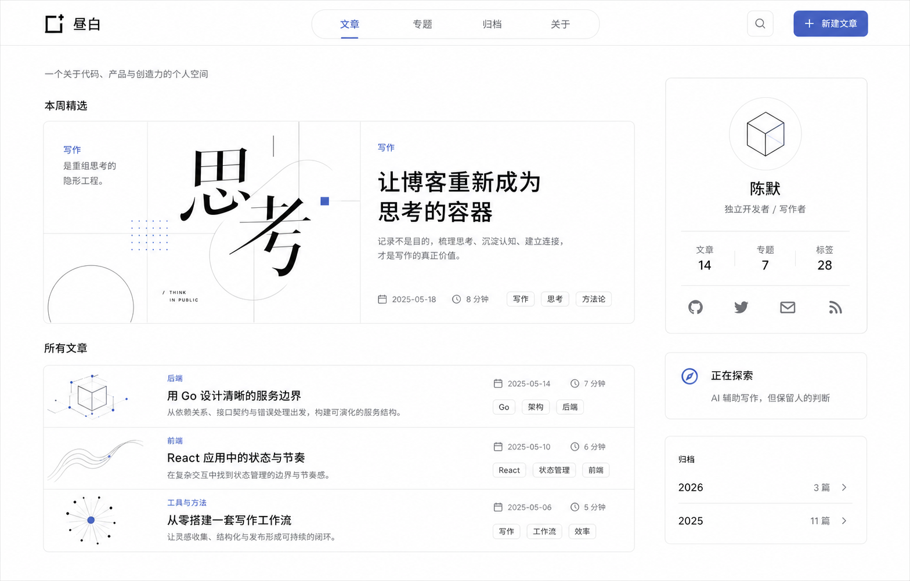

# 方案 C：昼白博客 UI 规范

## 设计目标

- 以内容阅读为中心，保持安静、清晰、长期耐看的视觉气质。
- 页面约 90% 使用白色和近白色，仅以低饱和靛蓝强调交互状态。
- 组件使用真实文章、标签和分页数据，不硬编码演示数字。
- 桌面端采用内容区与信息侧栏双栏布局，移动端自然折叠为单栏。

## 页面结构

1. 顶部导航：品牌、文章/专题/归档/关于、搜索、新建文章。
2. 首页引言：一句简短的站点定位。
3. 本周精选：最新一篇文章，以大尺寸图文卡片展示。
4. 所有文章：紧凑的横向文章列表，支持标签筛选、搜索和分页。
5. 作者侧栏：简介、文章/专题/标签统计、社交入口。
6. 正在探索：当前关注方向。
7. 归档：按年份展示当前数据中的文章数量。

## 设计令牌

| 类型 | 值 |
| --- | --- |
| 页面背景 | `#ffffff` |
| 次级表面 | `#f7f7f6` |
| 主文字 | `#171717` |
| 次文字 | `#737373` |
| 边框 | `#e7e7e5` |
| 强调色 | `#5868b2` |
| 强调色悬停 | `#46569f` |
| 卡片圆角 | `14px` |
| 控件圆角 | `10px` |
| 内容最大宽度 | `1440px` |
| 桌面双栏 | `minmax(0, 1fr) 320px` |

## 排版与间距

- 中文字体优先使用系统无衬线字体，保证跨平台清晰度。
- 标题采用较紧凑的字距与较高字重；正文和元数据保持自然行高。
- 以 8px 为基础间距单位；卡片内部主要使用 24px–32px 间距。
- 阴影仅用于悬浮反馈，不作为常驻的层级手段。

## 响应式规则

- `>= 1100px`：内容区与 320px 侧栏并排，侧栏可保持粘性定位。
- `< 1100px`：侧栏移至文章列表下方，并改为两列信息卡片。
- `< 720px`：导航收紧，精选文章改为单栏，文章缩略图隐藏或缩小。
- 所有交互元素保持至少 40px 的触控高度，并提供键盘焦点样式。

## 实现约束

- 不使用大面积渐变、玻璃拟态和高饱和色块。
- 插图优先使用 CSS 几何图形，避免为装饰引入沉重图片资源。
- 搜索通过 URL 查询参数保存；标签筛选继续使用现有 API 参数。
- 文章详情和编辑页复用同一套颜色、边框、圆角与内容宽度。

